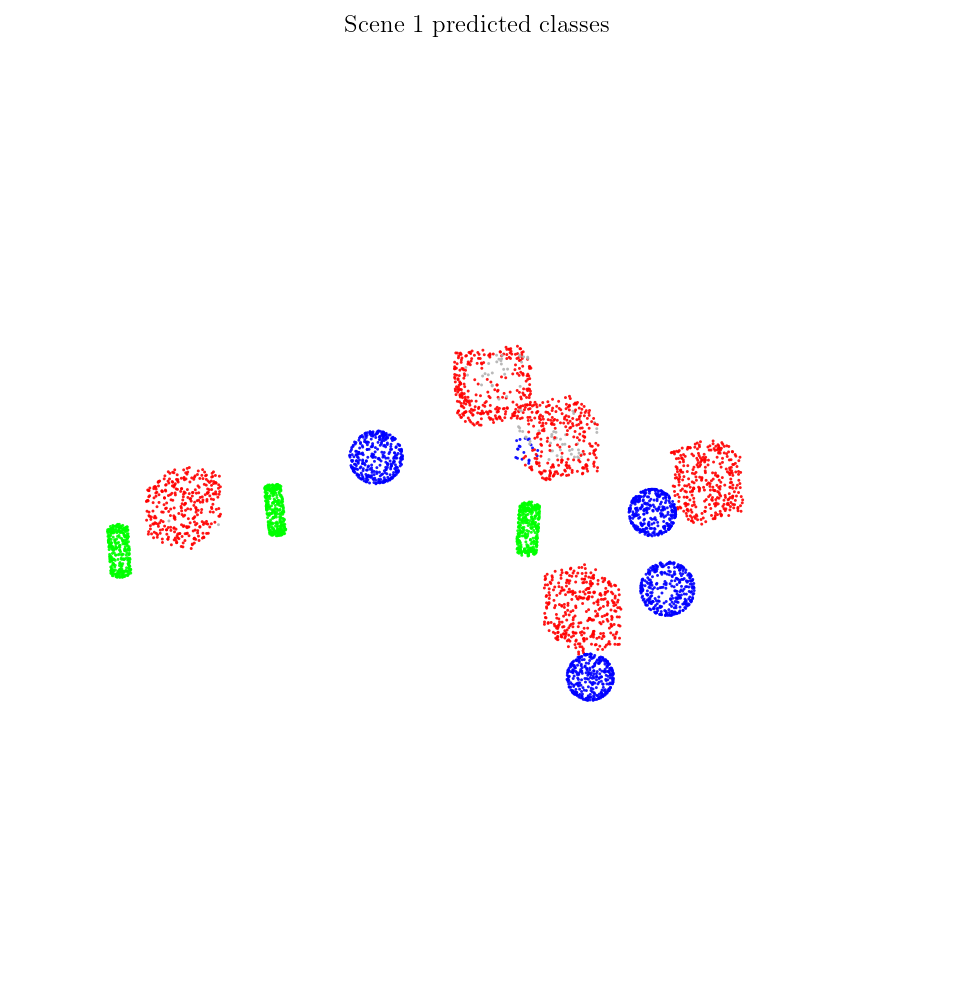
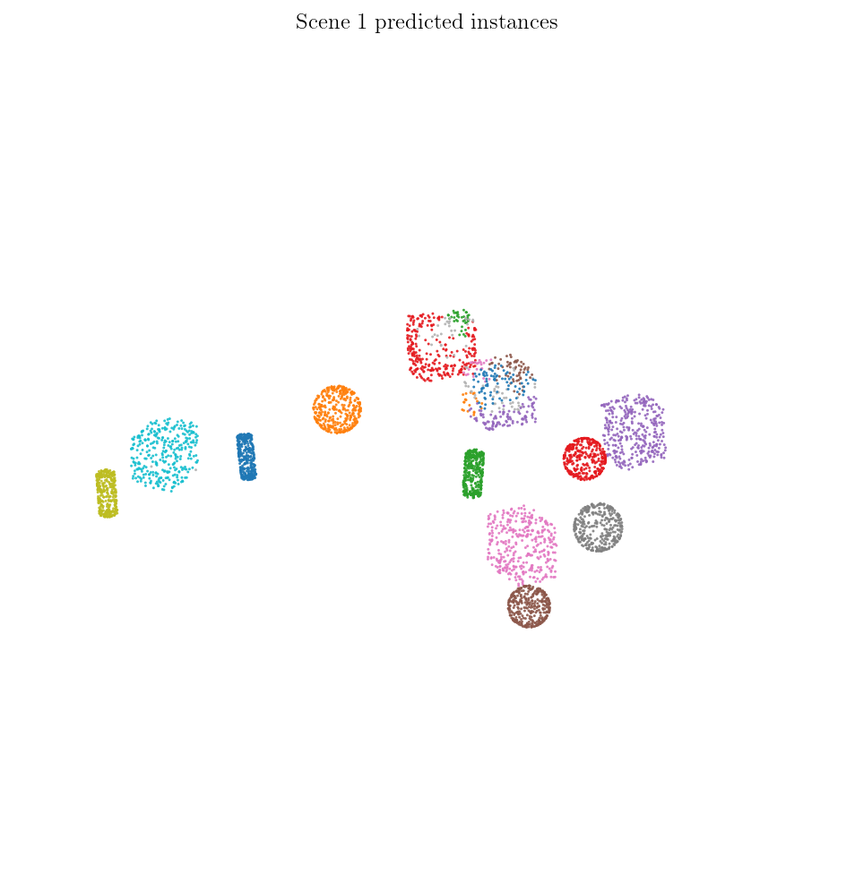
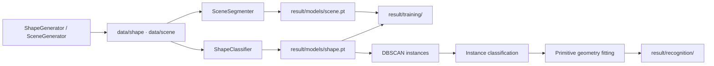

# PointLearn3D

[](https://github.com/Geng-Li-1995/PointLearn3D/actions/workflows/ci.yml)

**Procedural 3D point clouds + PointNet-style learning** for cuboids, cylinders, and spheres.

Generate synthetic multi-object scenes, cache datasets to disk, train a global shape classifier and a per-point scene segmenter, then export Open3D previews, PNG figures, and training curves — all from one entry point: `python main.py`.

Scene recognition now runs as a layered pipeline: DBSCAN first groups separated objects into instances, the trained single-shape classifier labels each instance, and primitive geometry fitting estimates cuboid / cylinder / sphere parameters with confidence scores.

**Author:** [Dr. Geng Li](https://github.com/Geng-Li-1995)

---

## Results

Run `export_examples` and `plot_training_curves` in `config/input.py`, then `python main.py`. Figures are saved under `result/`.

Latest run, default dataset scale, Apple MPS:

| Stage | Result |
|-------|--------|
| Shape classification | Best accuracy `0.9840` at epoch 4; early-stopped after 5 epochs without improvement |
| Scene segmentation | Best accuracy `0.9719` at epoch 19; completed 20 epochs |
| Layered scene recognition | 3 exported scenes; point accuracy `0.8186`, `0.8369`, `0.8276`; detected 17, 10, 11 instances |

| Single shapes (class color) | Multi-object scenes (voxel placement) |
|:---:|:---:|
| Red · cuboid &nbsp; Green · cylinder &nbsp; Blue · sphere | One PNG per scene; labels match shape classes |

| Cuboid | Cylinder | Sphere |
|:------:|:--------:|:------:|
|  |  |  |

| Scene 1 | Scene 2 |
|:-------:|:-------:|
|  |  |

**Layered scene recognition** — prediction and instance diagnostics:

| Predicted shape class | Predicted instance id |
|:---------------------:|:---------------------:|
|  |  |

In the predicted-class view, **red = cuboid**, **green = cylinder**, **blue = sphere**, and gray means the point was not assigned to any recognized instance. In the instance-id view, each color is one DBSCAN cluster; colors do not represent shape classes. If one object has multiple colors, it was over-split. If two objects share one color, they were merged.

**Shape classification** — early-stopped run, 98.40% best accuracy:


**Scene segmentation** — KNN local features + global context, 97.19% best accuracy ([limitations](#limitations)):


---

## Quick start

```bash
git clone https://github.com/Geng-Li-1995/PointLearn3D.git
cd PointLearn3D
pip install -r requirements.txt
python main.py
```

| Requirement | Notes |
|-------------|--------|
| Python | 3.10+ (CI tests 3.10 – 3.12) |
| Packages | PyTorch, NumPy, Matplotlib, Open3D — see `requirements.txt` |
| Config | Edit **`config/input.py`** only; no CLI flags |
| Git | `data/*.npz` is ignored; `result/` may be committed |

**Minimal first run** — disable heavy steps while exploring:

```python
# config/input.py
preview_shape: bool = False
preview_scene: bool = False
num_samples_shape: int = 200
num_epochs_shape: int = 5
train_scene: bool = False
recognize_scene: bool = False
```

---

## How it works



### Pipeline (`config/config.py` → `run()`)

Stages run **in this order** when the corresponding switches are enabled:

| Stage | Switches | Output |
|-------|----------|--------|
| Preview | `preview_shape`, `preview_scene` | Open3D windows |
| Export | `export_examples` | `result/shape/`, `result/scene/` PNGs |
| Data | `prepare_data`, `prepare_shape`, `prepare_scene` | `data/*/dataset.npz` |
| Train | `train`, `train_shape`, `train_scene` | `result/models/*.pt` |
| Plots | `plot_training_curves` | `result/training/*_curves.png` |
| Recognition | `recognize_scene` | `result/recognition/*.json`, `result/recognition/*.png` |

If `prepare_data` and `train` run in the same invocation, training automatically sets `regen=False` so caches are not rebuilt twice.

### Simulation

`simulation/generation.py` samples **cuboid**, **cylinder**, and **sphere** surfaces, applies random rigid transforms, and places objects with a **voxel grid** (`VoxelEngine`) for overlap checks — not a KD-tree.

- **`ShapeGenerator`** — one primitive per sample, global class label  
- **`SceneGenerator`** — ~12 objects per scene, per-point segmentation labels  

### Dataset scale (defaults)

Values below match **`config/input.py`** out of the box. Override any field before running `python main.py`.

| | Shape (`train_shape`) | Scene (`train_scene`) |
|---|----------------------|------------------------|
| **Samples** | 3,000 | 1,000 |
| **Points per sample** | 1,024 | 4,096 |
| **Total labeled points** | ~3.1M | ~4.1M |
| **Label type** | 1 class per cloud | 1 class per point |
| **Classes** | 3 (cuboid / cylinder / sphere) | same 3 classes |
| **Batch size** | 16 | 4 |
| **Batches / epoch** | 187 | 250 |
| **Default epochs** | 30 | 20 |
| **Cache file** | `data/shape/dataset.npz` | `data/scene/dataset.npz` |

**Per-sample content**

| | Shape | Scene |
|---|-------|-------|
| Geometry | 1 random cuboid, cylinder, or sphere | ~12 objects (3–5 cuboids, 3–5 cylinders, remainder spheres) |
| Raw points / object | resampled to 1,024 | ~600 surface points / object, merged then resampled to 4,096 |
| Placement | Random SE(3) transform | Voxel collision-free layout in \(x,y \in [-10,10]\), \(z \in [-0.1,0.1]\) |
| Class balance | Uniform over 3 shapes | Per-point labels from object type |

**Training throughput (defaults, cached data)**

| | Shape | Scene |
|---|-------|-------|
| Optimizer | Adam, `lr=1e-3`, `weight_decay=1e-5` | same |
| Early stopping | result-driven, patience 5, `min_delta=1e-4` | same |
| `preload_workers=0` | all CPU cores when building cache | same |
| `num_workers=2`, `cpu_threads=8` | 2 DataLoader workers, 8 PyTorch CPU threads | same |
| Scene KNN | n/a | `scene_k_neighbors=24` |

Set `regen=True` to rebuild caches after changing `num_samples_*` or `num_points_*`. A mismatch between cache and config triggers an automatic rebuild.

`device="auto"` tries CUDA first, then Apple MPS, then CPU. When CPU is used, `cpu_threads=0` uses all CPU cores except the DataLoader workers. On Apple Silicon, MPS can be faster for larger tensor workloads, while CPU can still be competitive for small batches or operations that do not map well to MPS.

### Models (`learning/models.py`, `learning/train.py`)

| Task | Switch | Model | Input | Output weights | Log key |
|------|--------|-------|-------|----------------|---------|
| Shape classification | `train_shape` | `ShapeClassifier` | Single cloud, fixed points | `result/models/shape.pt` | `shape` |
| Scene segmentation | `train_scene` | `SceneSegmenter` | Multi-object cloud | `result/models/scene.pt` | `scene` |

Shape classification uses a PointNet-style global backbone. Scene segmentation uses local KNN edge features plus global context, then assigns a class logit to **every point**. Weights are trained independently.

### Layered scene recognition

After `shape.pt` is trained, `recognize_scene=True` runs a separate object-level recognition path:

1. **Instance grouping** — DBSCAN clusters the scene into spatially separated objects.
2. **Instance classification** — `ShapeClassifier` predicts cuboid / cylinder / sphere for each cluster.
3. **Geometry fitting** — PCA / residual-based primitive fits estimate object parameters and confidence.

Outputs are saved under `result/recognition/`:

| File | Contents |
|------|----------|
| `scene_01.json`, ... | Point accuracy, recognized instances, fitted primitive parameters, class confidence |
| `scene_01_pred.png`, ... | Scene colored by predicted shape class |
| `scene_01_instances.png`, ... | Scene colored by predicted instance id |
| `summary.json` | All exported recognition scenes |

This layered path is usually more reasonable for these synthetic scenes than asking a single per-point model to solve everything at once: first split objects, then classify each object, then estimate its geometry. The scene segmenter remains useful as a per-point baseline and for learning local context, but the recognition output is easier to inspect because it produces object instances and fitted parameters.

The recognition accuracy can be lower than scene segmentation accuracy because the first step is geometric clustering. In the latest run, `scene_01` produced 17 detected instances for a 12-object scene, which indicates DBSCAN over-splitting. Tune `recognition_cluster_eps` upward when objects are split too much, or downward when nearby objects merge.

Training supports **result-driven early stopping**: each epoch is judged by accuracy improvement, with loss improvement as a tie-breaker when accuracy is flat. The saved `*.pt` file uses the best epoch weights, not merely the final epoch. Metrics append to `result/training_log.json`; plots use the latest entry per stage. Ctrl+C still saves available progress.

---

## Configuration

All user-facing parameters live in **`config/input.py`**:

<details>
<summary><b>Pipeline switches</b></summary>

| Field | Default | Meaning |
|-------|---------|---------|
| `regen` | `True` | Rebuild NPZ caches when preparing data |
| `prepare_data` | `True` | Master switch for dataset preparation |
| `prepare_shape` / `prepare_scene` | `True` | Which caches to build |
| `train` | `True` | Master switch for training |
| `train_shape` / `train_scene` | `True` / `True` | Which models to train |
| `preview_shape` / `preview_scene` | `True` | Open3D interactive previews |
| `export_examples` | `True` | Save example PNGs |
| `plot_training_curves` | `True` | Plot loss / accuracy curves |
| `recognize_scene` | `True` | Run layered scene recognition |

</details>

<details>
<summary><b>Dataset & training</b></summary>

| Field | Default | Meaning |
|-------|---------|---------|
| `num_samples_shape` / `num_samples_scene` | 3000 / 1000 | Dataset size |
| `num_points_shape` / `num_points_scene` | 1024 / 4096 | Points per sample |
| `num_epochs_shape` / `num_epochs_scene` | 30 / 20 | Training epochs |
| `batch_size_shape` / `batch_size_scene` | 16 / 4 | Batch size |
| `lr` | `1e-3` | Adam learning rate |
| `weight_decay` | `1e-5` | L2 regularization |
| `scene_k_neighbors` | `24` | KNN neighbors for scene segmentation local features |
| `seed` | `42` | Reproducibility (`None` = random) |
| `cache` | `True` | Disk NPZ cache vs on-the-fly generation |
| `device` | `"auto"` | `"auto"` chooses `cuda -> mps -> cpu`; explicit `"cuda"`, `"mps"`, or `"cpu"` also supported |
| `preload_workers` | `0` | Preload processes (`0` = all cores) |
| `num_workers` | `2` | DataLoader workers (`0` = auto, leaves 1-2 cores for loading) |
| `cpu_threads` | `8` | PyTorch CPU compute threads (`0` = all CPU cores except DataLoader workers) |

</details>

<details>
<summary><b>Early stopping & preview</b></summary>

| Field | Default | Meaning |
|-------|---------|---------|
| `early_stop` | `True` | Stop automatically from epoch metrics |
| `early_stop_min_epochs` | `3` | Minimum epochs before stopping is allowed |
| `early_stop_patience` | `5` | Epochs without accuracy/loss improvement |
| `early_stop_min_delta` | `1e-4` | Minimum accuracy gain |
| `early_stop_loss_min_delta` | `1e-4` | Minimum loss drop when accuracy is flat |
| `target_accuracy` | `None` | Optional result threshold (e.g. `0.99`) |
| `scene_preview_count` | `3` | Scenes in Open3D preview |
| `scene_export_count` | `3` | Scenes in PNG export |
| `recognition_scene_count` | `3` | Generated scenes for layered recognition export |
| `recognition_cluster_eps` | `0.65` | DBSCAN radius in scene coordinates |
| `recognition_min_cluster_points` | `20` | Minimum points per DBSCAN instance |
| `recognition_refine_geometry` | `False` | Let primitive fit residuals override classifier labels |

</details>

---

## Project layout

```
PointLearn3D/
├── main.py                      # python main.py
├── config/
│   ├── input.py                 # ← edit this
│   └── config.py                # paths, constants, run()
├── simulation/generation.py     # primitives, voxel engine, generators
├── learning/
│   ├── datasets.py              # ShapeDataset, SceneDataset
│   ├── models.py                # model definitions
│   ├── train.py                 # training loops
│   ├── recognition.py           # instances -> shape classification -> geometry fits
│   ├── visualize.py             # Open3D, PNG export, curves
├── tests/                       # pytest
├── .github/workflows/ci.yml
├── data/                        # NPZ caches (git-ignored)
└── result/                      # models, logs, figures
```

---

## Development

```bash
pytest                    # full suite
pytest tests/test_train.py -v
```

CI ([`.github/workflows/ci.yml`](.github/workflows/ci.yml)) runs `pytest` on Ubuntu for Python **3.10, 3.11, 3.12** on every push/PR to `main` / `master`.

---

## Outputs

| Path | Description |
|------|-------------|
| `data/shape/dataset.npz` | Shape training cache (ignored by git) |
| `data/scene/dataset.npz` | Scene training cache (ignored by git) |
| `result/models/shape.pt` | Shape classifier weights |
| `result/models/scene.pt` | Scene segmenter weights |
| `result/training_log.json` | Per-epoch loss and accuracy |
| `result/training/shape_curves.png` | Shape training curves |
| `result/training/scene_curves.png` | Scene training curves |
| `result/shape/*.png` | Exported shape examples |
| `result/scene/scene_*.png` | Exported scene examples |
| `result/recognition/scene_*_pred.png` | Recognition scenes colored by predicted shape class |
| `result/recognition/scene_*_instances.png` | Recognition scenes colored by predicted instance id |
| `result/recognition/*.json` | Recognition metrics, instances, and fitted geometry parameters |

---

## Limitations

| Area | Status |
|------|--------|
| Shape classification | Stable baseline for single-primitive clouds |
| Scene segmentation | KNN local edge features + global context; still CPU-heavy for large point counts |
| Scene recognition | DBSCAN instance grouping works best for separated objects; close objects may split or merge |
| Scene generation | Voxel-grid placement only; no physics, occlusion, or sensor noise |

---

## Author & license

**Dr. Geng Li** — theoretical physics and lattice QCD background; scientific computing, HPC, and machine learning on structured 3D data.

**License:** not specified. Contact the author before redistribution or commercial use.
