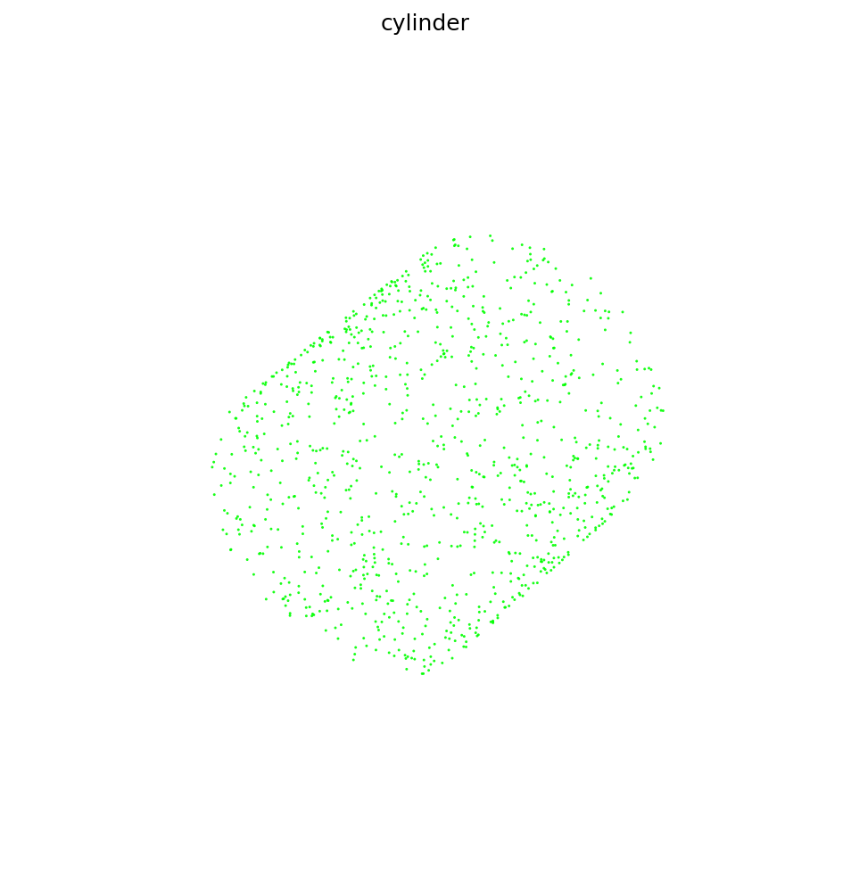
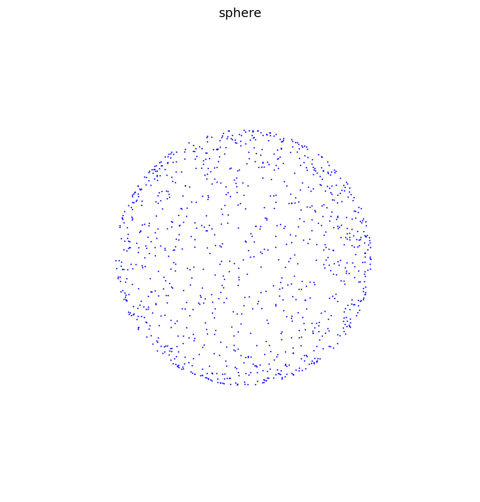
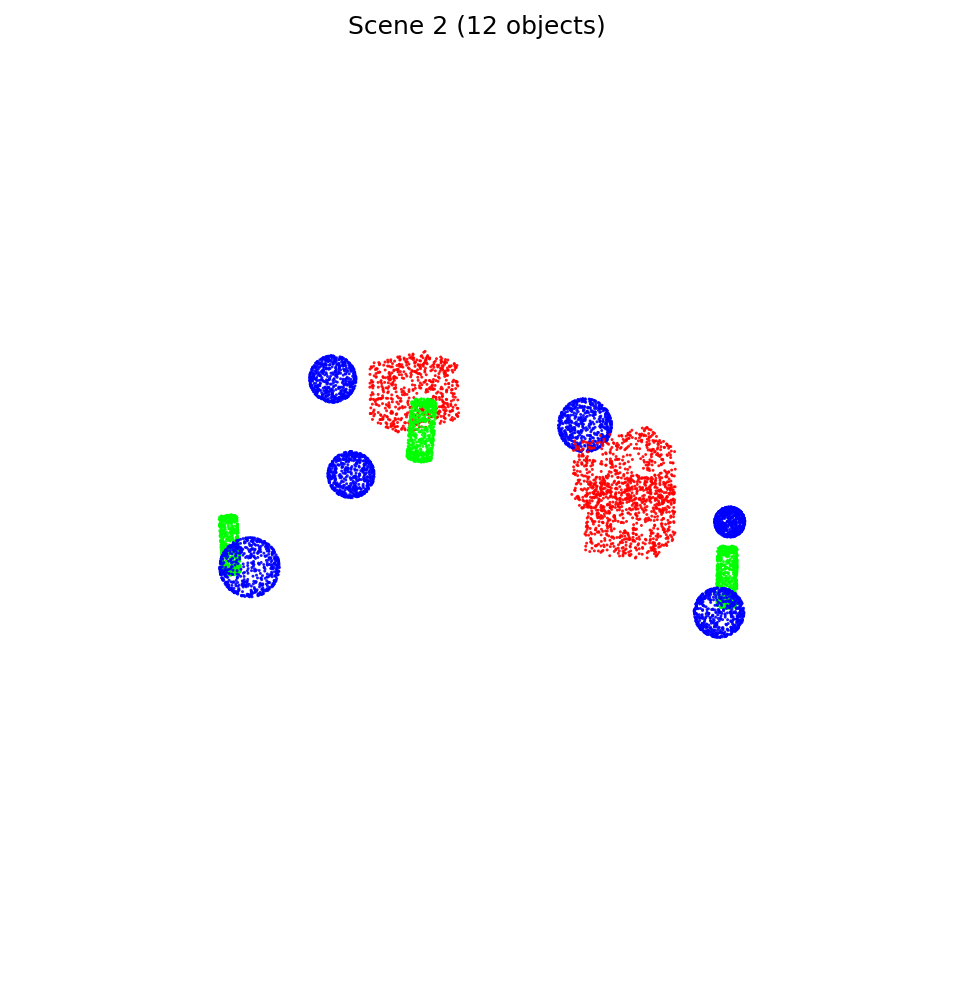
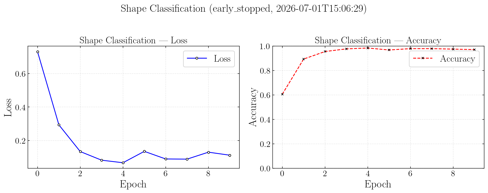
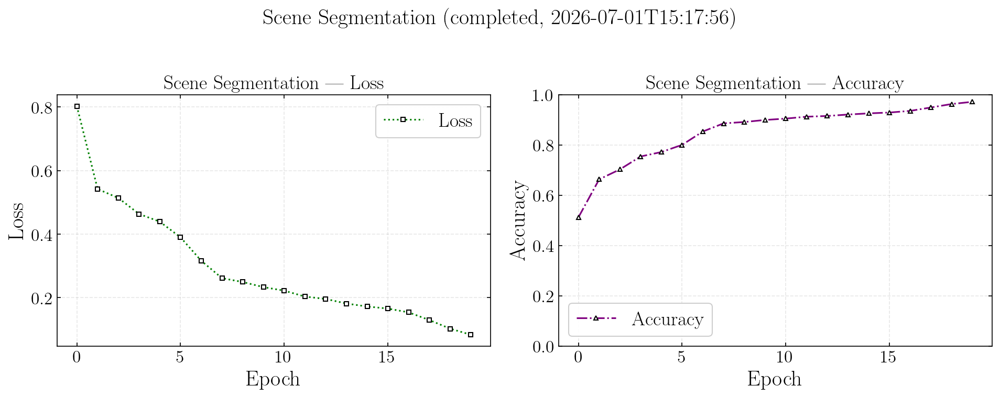
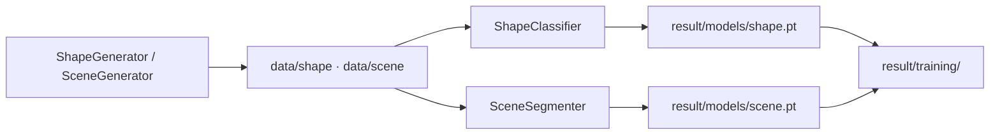

# PointLearn3D

[](https://github.com/Geng-Li-1995/PointLearn3D/actions/workflows/ci.yml)

**Procedural 3D point clouds + PointNet-style learning** for cuboids, cylinders, and spheres.

Generate synthetic multi-object scenes, cache datasets to disk, train a global shape classifier and a per-point scene segmenter, then export Open3D previews, PNG figures, and training curves — all from one entry point: `python main.py`.

**Author:** [Dr. Geng Li](https://github.com/Geng-Li-1995)

---

## Results

Run `export_examples` and `plot_training_curves` in `config/input.py`, then `python main.py`. Figures are saved under `result/`.

| Single shapes (class color) | Multi-object scenes (voxel placement) |
|:---:|:---:|
| Red · cuboid &nbsp; Green · cylinder &nbsp; Blue · sphere | One PNG per scene; labels match shape classes |

| Cuboid | Cylinder | Sphere |
|:------:|:--------:|:------:|
|  |  |  |

| Scene 1 | Scene 2 |
|:-------:|:-------:|
|  |  |

**Shape classification** — early-stopped run, ~96% accuracy:



**Scene segmentation** — baseline model ([limitations](#limitations)):



---

## Quick start

```bash
git clone https://github.com/Geng-Li-1995/PointLearn3D.git
cd PointLearn3D
pip install -r requirements.txt
python main.py
```

| Requirement | Notes |
|-------------|--------|
| Python | 3.10+ (CI tests 3.10 – 3.12) |
| Packages | PyTorch, NumPy, Matplotlib, Open3D — see `requirements.txt` |
| Config | Edit **`config/input.py`** only; no CLI flags |
| Git | `data/*.npz` is ignored; `result/` may be committed |

**Minimal first run** — disable heavy steps while exploring:

```python
# config/input.py
preview_shape: bool = False
preview_scene: bool = False
num_samples_shape: int = 200
num_epochs_shape: int = 5
train_scene: bool = False
```

---

## How it works



### Pipeline (`config/config.py` → `run()`)

Stages run **in this order** when the corresponding switches are enabled:

| Stage | Switches | Output |
|-------|----------|--------|
| Preview | `preview_shape`, `preview_scene` | Open3D windows |
| Export | `export_examples` | `result/shape/`, `result/scene/` PNGs |
| Data | `prepare_data`, `prepare_shape`, `prepare_scene` | `data/*/dataset.npz` |
| Train | `train`, `train_shape`, `train_scene` | `result/models/*.pt` |
| Plots | `plot_training_curves` | `result/training/*_curves.png` |

If `prepare_data` and `train` run in the same invocation, training automatically sets `regen=False` so caches are not rebuilt twice.

### Simulation

`simulation/generation.py` samples **cuboid**, **cylinder**, and **sphere** surfaces, applies random rigid transforms, and places objects with a **voxel grid** (`VoxelEngine`) for overlap checks — not a KD-tree.

- **`ShapeGenerator`** — one primitive per sample, global class label  
- **`SceneGenerator`** — ~12 objects per scene, per-point segmentation labels  

### Dataset scale (defaults)

Values below match **`config/input.py`** out of the box. Override any field before running `python main.py`.

| | Shape (`train_shape`) | Scene (`train_scene`) |
|---|----------------------|------------------------|
| **Samples** | 3,000 | 1,000 |
| **Points per sample** | 1,024 | 4,096 |
| **Total labeled points** | ~3.1M | ~4.1M |
| **Label type** | 1 class per cloud | 1 class per point |
| **Classes** | 3 (cuboid / cylinder / sphere) | same 3 classes |
| **Batch size** | 16 | 4 |
| **Batches / epoch** | 187 | 250 |
| **Default epochs** | 30 | 20 |
| **Cache file** | `data/shape/dataset.npz` | `data/scene/dataset.npz` |

**Per-sample content**

| | Shape | Scene |
|---|-------|-------|
| Geometry | 1 random cuboid, cylinder, or sphere | ~12 objects (3–5 cuboids, 3–5 cylinders, remainder spheres) |
| Raw points / object | resampled to 1,024 | ~600 surface points / object, merged then resampled to 4,096 |
| Placement | Random SE(3) transform | Voxel collision-free layout in \(x,y \in [-10,10]\), \(z \in [-0.1,0.1]\) |
| Class balance | Uniform over 3 shapes | Per-point labels from object type |

**Training throughput (defaults, cached data)**

| | Shape | Scene |
|---|-------|-------|
| Optimizer | Adam, `lr=1e-3`, `weight_decay=1e-5` | same |
| Early stopping | patience 5, `min_delta=1e-4` | same |
| `preload_workers=0` | all CPU cores when building cache | same |
| `num_workers=0` | DataLoader uses `cpu_count − 1` (0 when reading cache) | same |

Set `regen=True` to rebuild caches after changing `num_samples_*` or `num_points_*`. A mismatch between cache and config triggers an automatic rebuild.

### Models (`learning/train.py`)

| Task | Switch | Model | Input | Output weights | Log key |
|------|--------|-------|-------|----------------|---------|
| Shape classification | `train_shape` | `ShapeClassifier` | Single cloud, fixed points | `result/models/shape.pt` | `shape` |
| Scene segmentation | `train_scene` | `SceneSegmenter` | Multi-object cloud | `result/models/scene.pt` | `scene` |

Both use a PointNet-style backbone (`PointFeatureBackbone` + max-pool). Shape classification pools globally; scene segmentation assigns a class logit to **every point**. Weights are trained independently.

Training supports **early stopping**, optional **target accuracy**, and **Ctrl+C** (saves current epoch weights + log). Metrics append to `result/training_log.json`; plots use the latest entry per stage.

---

## Configuration

All user-facing parameters live in **`config/input.py`**:

<details>
<summary><b>Pipeline switches</b></summary>

| Field | Default | Meaning |
|-------|---------|---------|
| `regen` | `True` | Rebuild NPZ caches when preparing data |
| `prepare_data` | `True` | Master switch for dataset preparation |
| `prepare_shape` / `prepare_scene` | `True` | Which caches to build |
| `train` | `True` | Master switch for training |
| `train_shape` / `train_scene` | `True` / `True` | Which models to train |
| `preview_shape` / `preview_scene` | `True` | Open3D interactive previews |
| `export_examples` | `True` | Save example PNGs |
| `plot_training_curves` | `True` | Plot loss / accuracy curves |

</details>

<details>
<summary><b>Dataset & training</b></summary>

| Field | Default | Meaning |
|-------|---------|---------|
| `num_samples_shape` / `num_samples_scene` | 3000 / 1000 | Dataset size |
| `num_points_shape` / `num_points_scene` | 1024 / 4096 | Points per sample |
| `num_epochs_shape` / `num_epochs_scene` | 30 / 20 | Training epochs |
| `batch_size_shape` / `batch_size_scene` | 16 / 4 | Batch size |
| `lr` | `1e-3` | Adam learning rate |
| `weight_decay` | `1e-5` | L2 regularization |
| `seed` | `42` | Reproducibility (`None` = random) |
| `cache` | `True` | Disk NPZ cache vs on-the-fly generation |
| `device` | `"auto"` | `"cuda"` or `"cpu"` |
| `preload_workers` | `0` | Preload processes (`0` = all cores) |
| `num_workers` | `0` | DataLoader workers (`0` = `cpu_count - 1`) |

</details>

<details>
<summary><b>Early stopping & preview</b></summary>

| Field | Default | Meaning |
|-------|---------|---------|
| `early_stop` | `True` | Stop when accuracy plateaus |
| `early_stop_patience` | `5` | Epochs without improvement |
| `early_stop_min_delta` | `1e-4` | Minimum accuracy gain |
| `target_accuracy` | `None` | Stop once reached (e.g. `0.99`) |
| `scene_preview_count` | `3` | Scenes in Open3D preview |
| `scene_export_count` | `3` | Scenes in PNG export |

</details>

---

## Project layout

```
PointLearn3D/
├── main.py                      # python main.py
├── config/
│   ├── input.py                 # ← edit this
│   └── config.py                # paths, constants, run()
├── simulation/generation.py     # primitives, voxel engine, generators
├── learning/
│   ├── datasets.py              # ShapeDataset, SceneDataset
│   ├── train.py                 # models + training loops
│   ├── visualize.py             # Open3D, PNG export, curves
│   └── plot_set.py              # matplotlib style
├── tests/                       # pytest (22 tests)
├── .github/workflows/ci.yml
├── data/                        # NPZ caches (git-ignored)
└── result/                      # models, logs, figures
```

---

## Development

```bash
pytest                    # full suite
pytest tests/test_train.py -v
```

CI ([`.github/workflows/ci.yml`](.github/workflows/ci.yml)) runs `pytest` on Ubuntu for Python **3.10, 3.11, 3.12** on every push/PR to `main` / `master`.

---

## Outputs

| Path | Description |
|------|-------------|
| `data/shape/dataset.npz` | Shape training cache (ignored by git) |
| `data/scene/dataset.npz` | Scene training cache (ignored by git) |
| `result/models/shape.pt` | Shape classifier weights |
| `result/models/scene.pt` | Scene segmenter weights |
| `result/training_log.json` | Per-epoch loss and accuracy |
| `result/training/shape_curves.png` | Shape training curves |
| `result/training/scene_curves.png` | Scene training curves |
| `result/shape/*.png` | Exported shape examples |
| `result/scene/scene_*.png` | Exported scene examples |

---

## Limitations

| Area | Status |
|------|--------|
| Shape classification | Stable baseline for single-primitive clouds |
| Scene segmentation | **Work in progress** — lightweight max-pool + broadcast head; no PointNet++ / local–global fusion yet; weak on dense or overlapping scenes |
| Scene generation | Voxel-grid placement only; no physics, occlusion, or sensor noise |

---

## Author & license

**Dr. Geng Li** — theoretical physics and lattice QCD background; scientific computing, HPC, and machine learning on structured 3D data.

**License:** not specified. Contact the author before redistribution or commercial use.
