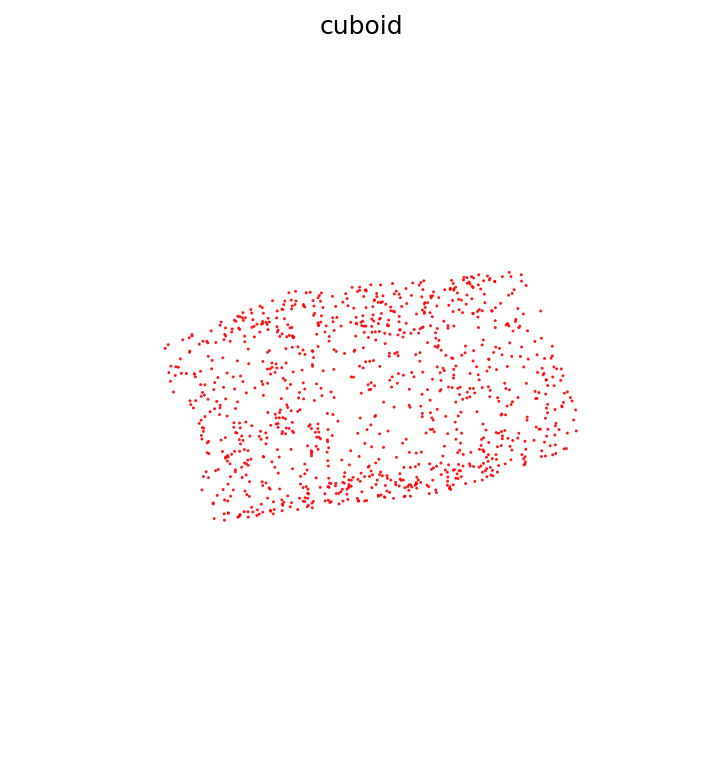
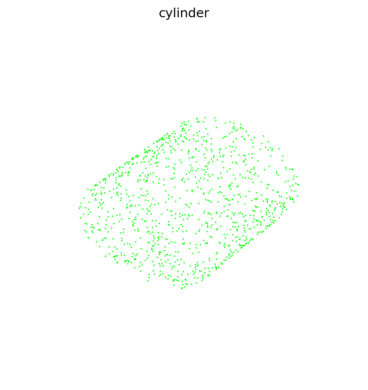
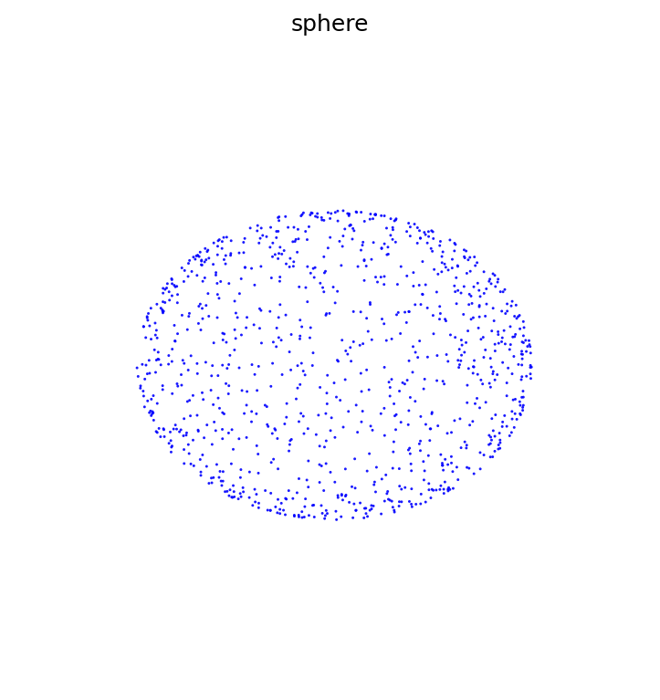
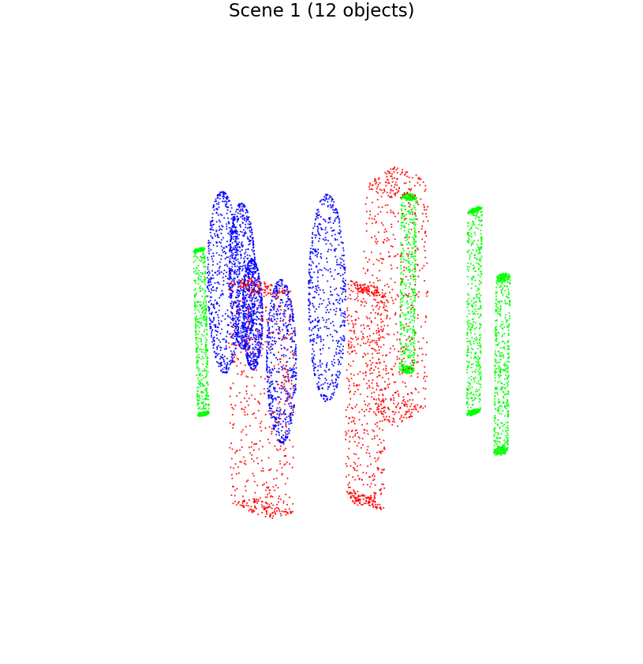
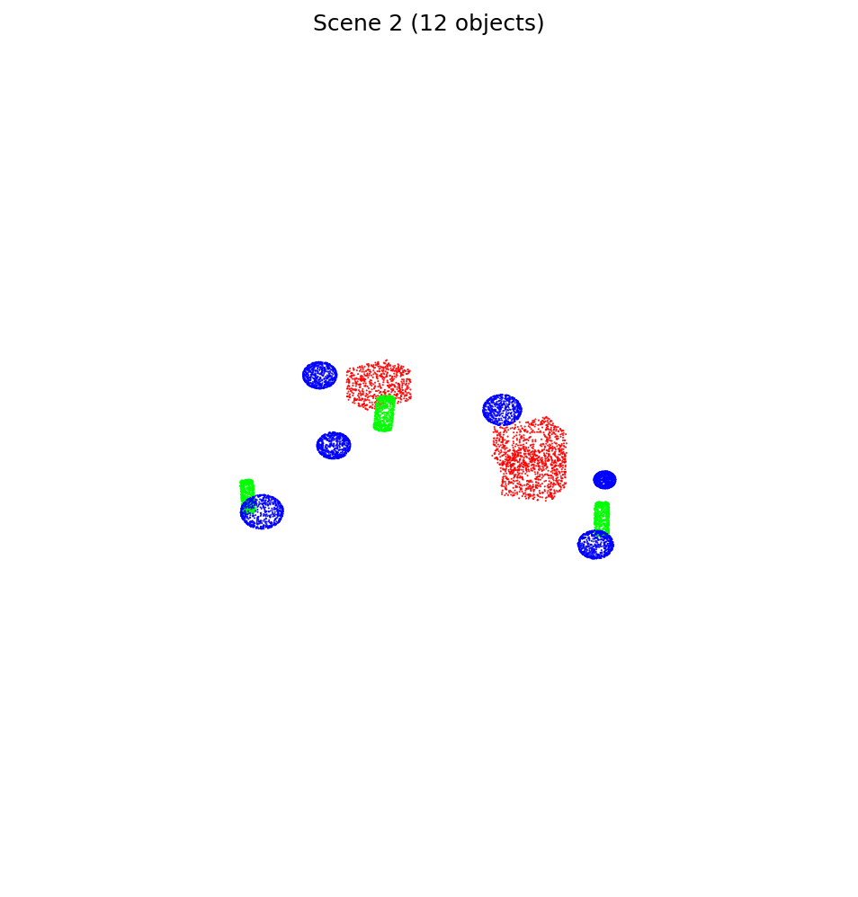
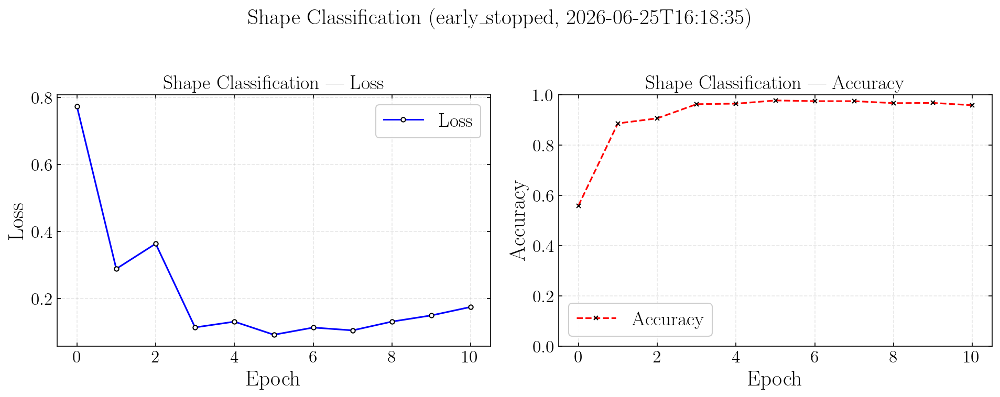
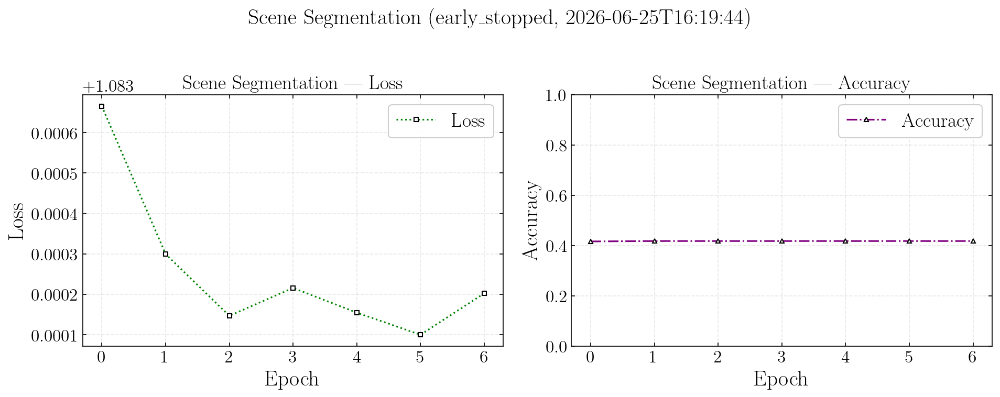

# PointLearn3D

Procedural 3D scene simulation and PointNet-style point cloud learning for cuboids, cylinders, and spheres.

This project provides an end-to-end, reproducible pipeline: synthetic geometry generation, dataset caching, single-shape classification, multi-object scene segmentation, Open3D interactive previews, and Matplotlib training-curve export.

**Author:** Dr. Geng Li

---

## Features

| Module | Description |
|--------|-------------|
| `simulation/generation.py` | Parametric primitive sampling, voxel collision checks, shape/scene generation |
| `learning/datasets.py` | `ShapeDataset` / `SceneDataset` with NPZ disk cache and parallel preloading |
| `learning/train.py` | `ShapeClassifier` (global classification), `SceneSegmenter` (per-point segmentation) |
| `learning/visualize.py` | Open3D previews, PNG export, training curve plots |
| `config/input.py` | Single configuration entry point: switches, hyperparameters, early stopping |

---

## Project layout

```
PointLearn3D/
├── main.py                  # Entry: python main.py
├── config/
│   ├── input.py             # User-editable parameters
│   └── config.py            # Paths, constants, run()
├── simulation/
│   └── generation.py
├── learning/
│   ├── datasets.py
│   ├── train.py
│   ├── visualize.py
│   └── plot_set.py
├── data/                    # Dataset cache (git-ignored; see below)
├── docs/images/             # Readme figure snapshots
├── result/                  # Models, logs, visualization outputs
├── tests/                   # pytest suite
└── requirements.txt
```

---

## Quick start

**Requirements:** Python 3.10+. See `requirements.txt` (PyTorch, NumPy, Matplotlib, Open3D).

```bash
pip install -r requirements.txt
python main.py
```

All behavior is controlled in **`config/input.py`**. There is no CLI `--mode`. Typical workflow:

1. Enable `preview_shape` / `preview_scene` / `export_examples` as needed
2. Set `prepare_data=True` to build caches under `data/shape/` and `data/scene/`
3. Run `train_shape` / `train_scene` to write weights to `result/models/`
4. Set `plot_training_curves=True` to save plots under `result/training/`

**Git:** Only generated NPZ files under `data/` are ignored. Models, images, and logs under `result/` can be committed normally.

### Tests

```bash
pip install -r requirements.txt
pytest
```

Run a single file: `pytest tests/test_train.py -v`

CI runs on GitHub Actions (`.github/workflows/ci.yml`) for Python 3.10–3.12 on every push/PR to `main`.

---

## Visualizations

Examples below come from `export_examples` and `plot_training_curves` (copies in `docs/images/`). Re-run `python main.py` to refresh outputs in `result/`.

### Single-shape point clouds

Red = cuboid, green = cylinder, blue = sphere:

| Cuboid | Cylinder | Sphere |
|:------:|:--------:|:------:|
|  |  |  |

### Multi-object scenes

Voxel-grid collision-free placement; colors encode object class:

| Scene 1 (12 objects) | Scene 2 |
|:--------------------:|:-------:|
|  |  |

### Training curves

**Shape classification** (~96% accuracy after early stopping):



**Scene segmentation** (baseline model; still needs improvement — see [Known limitations](#known-limitations)):



---

## Pipeline stages

`run()` in `config/config.py` executes in order:

| Order | Switch | Action |
|------:|--------|--------|
| 1 | `preview_shape` | Open3D preview of all three shape types |
| 2 | `preview_scene` | Open3D preview of `scene_preview_count` scenes |
| 3 | `export_examples` | Export PNGs to `result/shape/`, `result/scene/` |
| 4 | `prepare_data` | Build `data/` caches (respects `regen`) |
| 5 | `train` | Train models → `result/models/` |
| 6 | `plot_training_curves` | Plot curves → `result/training/` |

---

## Training

### Shape classification (`train_shape`)

- **Input:** single-object point cloud, fixed point count
- **Model:** `ShapeClassifier` (PointNet-style global max-pool + MLP)
- **Weights:** `result/models/shape.pt`
- **Log stage key:** `shape`

### Scene segmentation (`train_scene`)

- **Input:** multi-object scene point cloud with per-point labels
- **Model:** `SceneSegmenter` (per-point logits; trained independently from shape classification)
- **Weights:** `result/models/scene.pt`
- **Log stage key:** `scene`

> **Work in progress.** `SceneSegmenter` is a lightweight baseline: global features are max-pooled at each block and broadcast to every point. It does not implement full local–global feature fusion (as in the original PointNet segmentation head) or stronger backbones (e.g. PointNet++). Segmentation accuracy on dense or overlapping scenes may be limited. Planned improvements: richer architecture, better sampling/normalization, and metrics beyond point-wise accuracy.

Metrics are appended to `result/training_log.json`. Curve plots use the latest run per stage.

---

## Scene generation

`SceneGenerator` randomly places cuboids, cylinders, and spheres in a bounded volume. Overlap is checked with a **voxel grid** (`VoxelEngine`), not a KD-tree. Each object is resampled to a fixed point count and stored with its class label.

---

## Configuration

Edit `config/input.py`:

| Group | Key fields |
|-------|------------|
| Switches | `regen`, `prepare_data`, `prepare_shape`, `prepare_scene`, `train`, `train_shape`, `train_scene`, `preview_*`, `export_examples`, `plot_training_curves` |
| Dataset | `num_samples_shape`, `num_samples_scene`, `num_points_shape`, `num_points_scene`, `seed`, `cache`, `preload_workers` |
| Training | `num_epochs_shape`, `num_epochs_scene`, `batch_size_shape`, `batch_size_scene`, `lr`, `weight_decay`, `num_workers`, `device` |
| Early stop | `early_stop`, `early_stop_patience`, `early_stop_min_delta`, `target_accuracy` |
| Preview / export | `scene_preview_count`, `scene_export_count` |

**Notes**

- `preload_workers=0` uses all CPU cores for parallel dataset preloading
- `num_workers=0` lets DataLoader pick `cpu_count - 1`
- If `prepare_data` and `train` run in the same invocation, training sets `regen=False` automatically to avoid rebuilding caches
- **Ctrl+C** during training saves current weights and log before exiting

---

## Outputs

| Path | Contents |
|------|----------|
| `data/shape/dataset.npz` | Shape training cache (git-ignored) |
| `data/scene/dataset.npz` | Scene training cache (git-ignored) |
| `result/models/shape.pt`, `scene.pt` | Model weights |
| `result/training_log.json` | Per-epoch loss and accuracy |
| `result/training/*_curves.png` | Training curve plots |
| `result/shape/`, `result/scene/` | Exported example PNGs |

---

## Known limitations

| Area | Status |
|------|--------|
| Shape classification | Stable baseline for single-primitive clouds |
| Scene segmentation | **Needs optimization** — simplified model and training; limited accuracy on multi-object scenes |
| Scene generation | Voxel placement only; no physics or realistic occlusion |

---

## Author

**Dr. Geng Li**

Background in theoretical physics and computational high-energy physics (lattice QCD). Research interests include scientific computing, HPC, and machine learning on structured data.

For collaboration, citation, or further information, please contact the author via the repository contact details.

---

## License

Not specified. Contact the maintainer before redistribution.
